<!--
  Repo copy of the TrainApp Decision Log.
  Notion is the master version. When a decision changes in Notion, update this file
  in the same sitting and commit it alongside the code change it affects.
  Last synced with Notion: 2026-09-22
-->

# TrainApp — Decision Log · Phase 1: Architecture

> **Status:** Decided · **Last updated:** 22 September 2026
> This log records *what* we decided, *why*, and *what we gave up*. Every entry opens with a plain-language summary, so you don't need a technical background to follow it. Technical details for development sit in their own sub-section at the end of each entry.

**How to read the diagrams — the colours mean the same thing everywhere:**

| Colour | Meaning |
|---|---|
| Blue | Happens on your iPhone (works with no signal) |
| Green | Happens on the server (only when there's signal) |
| Yellow | The plan — reusable routines |
| Purple | History — what you actually did |
| Red | A rule or decision point |

---

## At a glance

| # | Area | What we decided |
|---|---|---|
| ARCH-01 | Routines & workouts | Routines are reusable plans. Starting one copies it into a workout record, so history never changes. |
| ARCH-02 | Ground rules for data | Every record gets a unique ID made on the phone, is never truly deleted, and stores exactly what was entered. |
| ARCH-03 | Previous weight, set types, rest timer | Shows last time's weight per set, supports warm-up and drop sets, and has a rest timer that works with the phone locked. |
| ARCH-04 | Modules & tab bar | Training, bodyweight, food and goals are separate modules in a customizable tab bar. |
| ARCH-05 | Syncing | The phone and server swap changes in two steps, pull then push, and retries are always safe. |
| ARCH-06 | Conflicts | Different changes are all kept. If the same thing was changed twice, the latest change wins. |
| ARCH-07 | Server database | Postgres |
| ARCH-08 | Phone database | expo-sqlite + Drizzle, with our own sync code |
| ARCH-09 | Sign-in | Email + password, and Sign in with Apple |
| ARCH-10 | Custom exercises | Exercises you create are saved to your library under "User-created exercises". |

---

## The big picture

TrainApp is **offline-first**. Everything you do in the app is saved on your phone instantly, and copied to the server later when there's signal. Logging a set never waits for the internet.

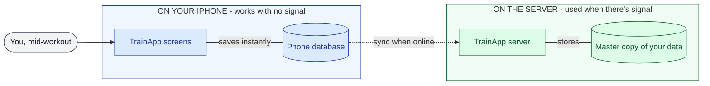

---

## ARCH-01 · Routines and workouts

**In short:** A *routine* is a reusable plan, like "Push Day A". A *workout* is a record of what you actually did. When you start a workout from a routine, the plan is **copied** into the workout. Changing a routine later never changes your history.

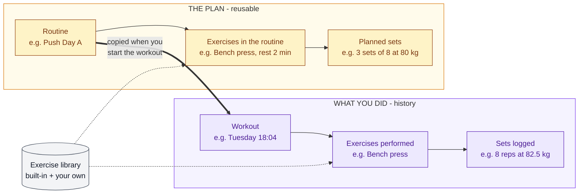

**Changing a routine during a workout.** If you do something different from the plan, TrainApp asks at the end what to do with the routine. Your workout history is saved exactly as you did it, whatever you choose.

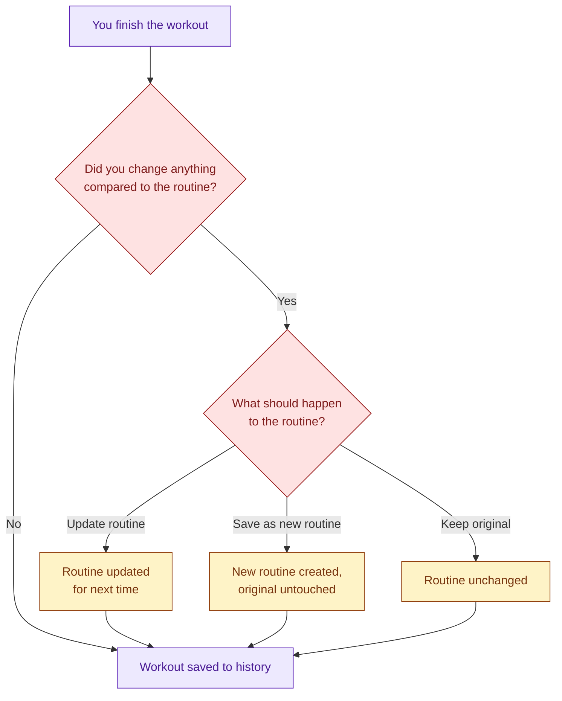

**Why:**
- History must show what you actually lifted. Copying guarantees that.
- Plans and records live in separate places, so editing a routine on one device can never collide with logging a workout on another.

**What we gave up:** Some information is stored twice, once in the routine and once in the workout. At this scale that costs nothing noticeable.

**Alternative considered:** Workouts that *point at* the routine instead of copying it. That avoids storing things twice, but editing a routine would silently rewrite past workouts. Rejected.

**Reference:** Hevy uses the same split and the same "update routine or keep original" prompt.

#### Technical detail
- Plan side: `Routine` → `RoutineExercise` (position, default rest) → `RoutineSet` (set type, target reps, target weight).
- History side: `WorkoutSession` (optional `routine_id`) → `SessionExercise` (position, rest, notes) → `Set`.
- Both sides reference `ExerciseDefinition`. `SessionExercise` allows ordering, per-exercise notes, and the same exercise twice in one session.

---

## ARCH-02 · Ground rules for all data

**In short:** A handful of rules every piece of data follows, so that offline use and syncing stay safe.

| Rule | In plain words | Why |
|---|---|---|
| **IDs are made on the phone** | Every record gets a unique ID the moment it's created, with no internet needed. | The server can't hand out IDs when you're offline, and two phones will never pick the same ID. |
| **Nothing is truly deleted** | Deleting marks a record as "deleted" instead of erasing it. | A deletion has to reach your other devices. An erased record leaves nothing to send. |
| **Every record knows its owner** | Each record is tagged with the user it belongs to. | The server can fetch "all of this user's changes" in one simple step. |
| **Weight is stored as entered** | 45 lb is saved as "45, lb", not converted to kg. | Converting back and forth creates rounding errors, e.g. 45 lb becomes 44.99 lb. |
| **Time is stored consistently** | Exact moments use universal time plus your time zone. Day-based entries (future weigh-ins, meals) store the calendar date. | Workouts, food and bodyweight can later be lined up correctly by day, even when travelling. |
| **Totals are calculated, not saved** | Progress, personal records and "previous weight" are worked out from your logged sets whenever they're needed. | There's nothing extra to keep in sync, and settings like "don't count warm-ups" can recalculate all of history. |

**What we gave up:** "Deleted" records slowly pile up; a cleanup job can be added later. Calculated totals may need caching once the analytics phase arrives.

#### Technical detail
- IDs are UUIDv7, which sorts by time.
- Deletes are soft deletes: a `deleted_at` column, with tombstone rows synced like any other row.
- `user_id` is set on every synced table, including child rows.

---

## ARCH-03 · Previous weight, set types and rest timer

### Previous weight

**In short:** When you add an exercise, TrainApp shows what you lifted **the last time you did that exercise**, in any routine, set by set.

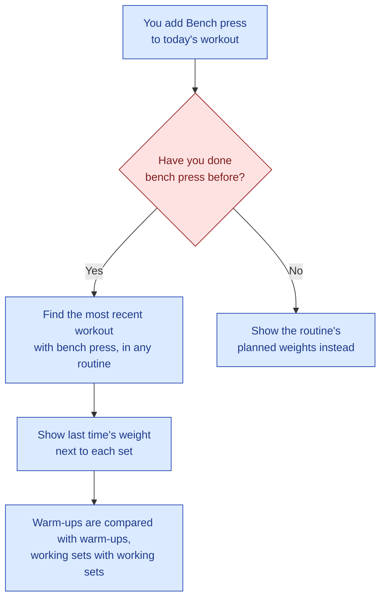

Because this only reads data already on your phone, it works with no signal at all.

### Set types

| Type | Label | What it means |
|---|---|---|
| Warm-up | **W** | A lighter set to prepare. Can be excluded from stats later. |
| Working | — | A normal set. This is the default. |
| Drop set | **D** | Continue straight after the previous set with less weight, with no rest in between. |

New types, such as "failure", can be added later without changing how data is stored.

### Rest timer

**In short:** Each exercise has a default rest time, taken from the routine and adjustable during the workout. The timer keeps working, and the phone buzzes, even when the screen is locked.

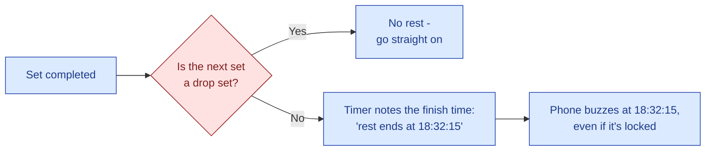

**Why it works this way:** iPhones pause apps when the screen locks, so a normal countdown would freeze. Saving the *finish time* and scheduling a notification for it keeps the timer accurate.

**What we gave up:** The actual rest you took isn't stored separately. It can be calculated later from the times your sets were completed.

#### Technical detail
- "Previous" values come from a local query over `Set` rows joined through `SessionExercise` on `exercise_definition_id`, ordered by session date.
- Sets are matched by position within the same set type.
- `set_type` is a text column with the values `warmup`, `working` and `drop`.
- The running timer is local UI state, not synced data. It is implemented as a stored end time plus a notification scheduled with `expo-notifications`.
- Possible future setting: "previous from the same routine only". Hevy offers both options.

---

## ARCH-04 · Modules and the tab bar

**In short:** TrainApp is built as separate **modules**: Training now, with Bodyweight, Food and Goals later. Each module is a tab in the bottom bar, and you choose which ones you see and in what order. This modularity is TrainApp's main difference from single-purpose apps like Hevy.

**What the tab bar will look like once all modules exist:**

| Training | Bodyweight | Food | Goals | Settings |
|:---:|:---:|:---:|:---:|:---:|
| **MVP** | later | later | later | always shown |

**How modules relate.** Each module keeps its own data. A module may *look at* another module's data, but never change it.

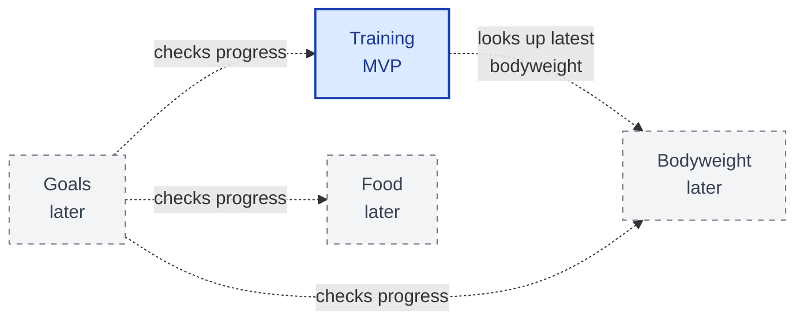

**Rules:**
- Turning a module off **hides** it. Your data is kept, and it still syncs in the background, so turning the module back on is instant.
- Settings is always visible, because it's where modules are switched on and off.
- Your module choices are saved to your account, so all your devices show the same tabs.

**Why:** Modules can be added one at a time without any risk to the ones that already work.

**MVP scope:** The module structure is built from the start. The MVP ships with Training and Settings only, and the on/off switches are added once a second module exists.

**What we gave up:** Tab bars get crowded beyond about five tabs. Past that, we'll need a "More" tab or pinned favourites.

#### Technical detail
- Each module exports a descriptor (id, title, icon, route). The tab bar is built from the enabled descriptors, in the user's order (Expo Router tabs).
- Enabled modules and their order are a synced user-settings record.
- Module dependencies are read-only and point one way.

---

## ARCH-05 · Syncing between phone and server

**In short:** When there's signal, the phone and server swap changes in two steps. First the phone **pulls**, asking what's new since last time. Then it **pushes**, sending what you logged offline. The server keeps a **bookmark** so it only ever sends what's new.

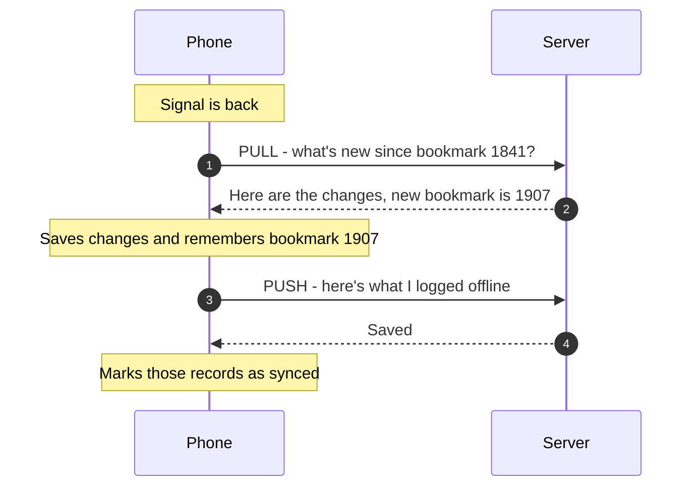

**Safe retries — built for bad gym signal.** Sometimes the server saves your data, but its reply is lost when the signal drops. The phone then sends the same data again. Because every record has its own unique ID, the server recognises the repeat and updates the record instead of creating a duplicate.

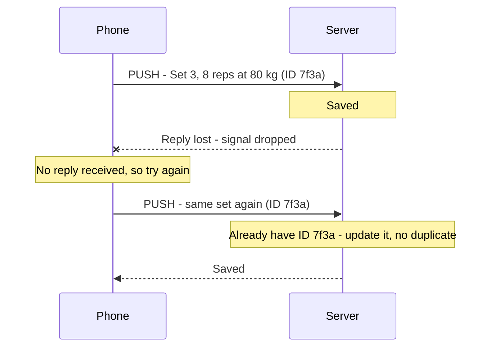

**When syncing happens:** when you open the app, when signal returns, and when you finish a workout. It always runs in the background and never makes you wait.

**Why:**
- The bookmark comes from the server, not the phone, because phone clocks can be wrong.
- Safe retries matter most in exactly the place TrainApp is used: a gym with poor signal.
- Sync works through a list of data tables, so new modules plug in without rewriting the sync.

**What we gave up:** One user's pushes are handled one at a time on the server. That's irrelevant at this scale.

#### Technical detail

```json
POST /sync/pull
{ "cursor": 1841, "schemaVersion": 1 }
→ { "cursor": 1907, "hasMore": false,
 "changes": { "exercise_definitions": [ …], "workout_sessions": [ …],
 "session_exercises": [ …], "sets": [ …] } }

POST /sync/push
{ "lastPulledCursor": 1907, "schemaVersion": 1, "changes": { /* same shape */ } }
→ 200 OK | 409 if the server changed since the cursor (pull, then retry)
```

- Every push write is an **upsert** keyed on the client UUID. This is what makes pushes idempotent.
- The server serializes writes per user by locking the user row in each push transaction, which prevents cursor gaps from out-of-order commits.
- Deletions travel as rows with `deleted_at` set.
- The synced-table list is ordered by dependency (exercise definitions → sessions → session exercises → sets). One push is applied in a single transaction.
- The phone sends `schemaVersion` and ignores tables it doesn't know, so older app versions keep working as modules are added.

---

## ARCH-06 · When two devices disagree (conflicts)

**In short:** Conflicts are rare, since it's one person, usually on one phone. When they do happen:

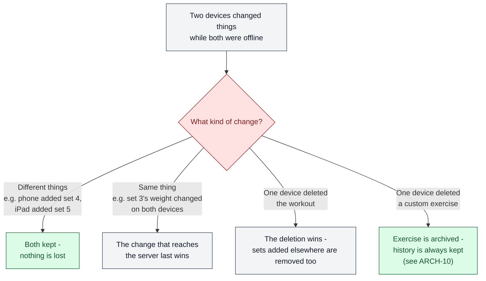

**Why:**
- Because every set is its own record, most "conflicts" are really two separate changes, and both are simply kept.
- "Last to reach the server wins" avoids trusting phone clocks.
- "Deletion wins" is predictable, and the case it sacrifices (logging a set into a workout you deleted on another device) is almost impossible in practice.

**What we gave up:** If two devices edit *different fields* of the same set, one edit can overwrite the other. Sets have very few fields, so this is acceptable. It can be upgraded to field-by-field merging later.

**Alternatives considered:**
- Field-by-field merging. More precise, but more complex.
- Asking the user to resolve conflicts. Overkill for this app.

#### Technical detail
- Row-level last-write-wins by server arrival order.
- Deletes cascade to children, except for `ExerciseDefinition`, which is archived instead (ARCH-10).

---

## ARCH-07 & ARCH-08 · Databases on the server and on the phone

**In short:** The server uses **Postgres**. The phone uses **SQLite** through **expo-sqlite**. A tool called **Drizzle** lets us describe and query data the same way on both, so there's one way of working to learn instead of two.

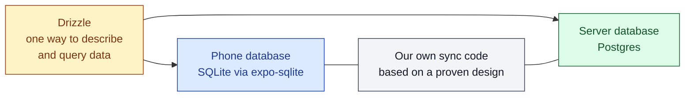

### ARCH-07 · Server: Postgres

**Why:**
- It runs reliably on normal hosting. A SQLite database on a server needs a special always-attached disk.
- It handles the locking that safe syncing relies on.
- Moving from SQLite to Postgres later is likely; the reverse is never needed.
- It's the most widely used and transferable server database skill.

**Alternative considered:** SQLite on the server. Simpler, and fine for one user, but with a lower ceiling. Rejected.

**What we gave up:** Running a database server adds setup work and a small hosting cost.

### ARCH-08 · Phone: expo-sqlite + Drizzle

**Why:**
- The "previous weight" lookup now, and cross-module insights later, need a real query language (SQL).
- Drizzle works on both phone and server.
- expo-sqlite is Expo's own package, so it always stays compatible.
- We have to build the server half of sync anyway. Building the phone half too means understanding the whole loop, which is a core learning goal of this project.

**Alternative considered:** WatermelonDB, which includes ready-made sync and automatic screen updates. Rejected because of:
- setup problems with recent Expo versions,
- a separate way of writing queries,
- less visibility into how its sync works.

**What we gave up:** Getting sync right is our responsibility. We reduce that risk by copying WatermelonDB's proven design and testing the tough cases: dropped connections, retries, and edits on two devices.

#### Technical detail
- Postgres runs in Docker on the development VM. Migrations are used from day one, for both databases.
- The phone-side sync consists of:
 - a sync status on each synced row,
 - an ordered list of synced tables,
 - pull and push routines,
 - the conflict rule from ARCH-06.
- Drizzle's live queries provide automatic screen updates when data changes.

---

## ARCH-09 · Signing in

**In short:** You can sign in with **email and password** or with **Sign in with Apple**. You sign in once on first launch. After that, TrainApp works fully offline, and signing in is only needed for syncing.

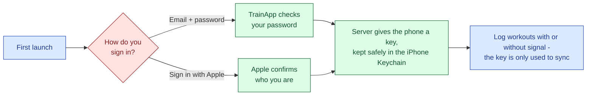

**One account, several ways in.** Your account is separate from how you sign in to it, so a second sign-in method can be connected to the same account later. Accounts are never merged automatically just because the email addresses match.

**Rules:**
- An expired key never stops you from logging. Syncing simply waits until the key can be renewed.
- If you ever need to sign in again, your data on the phone is kept. Workouts that haven't synced yet are never deleted.
- Build order: email + password first, then Sign in with Apple.

**Why:**
- Apple's rule that apps must offer Sign in with Apple (App Store Guideline 4.8) only applies to apps offering other companies' logins, such as Google. Email + password is TrainApp's own system, so Sign in with Apple is offered for convenience, not because it's required.
- The server issues its own key, so syncing never depends on Apple's servers being reachable.
- Apple lets users hide their real email address, so matching emails aren't reliable. Merging accounts by email is also a known security risk.

**What we gave up — email + password adds work on the server:**
- storing passwords securely,
- verification and password-reset emails (which need an email-sending service),
- limiting repeated login attempts,
- giving the same response whether an account exists or not.

**Things to remember for Sign in with Apple:**
- Apple only shares your name and email the very first time you sign in, so they must be saved then.
- Apps that let users create accounts must also let them delete their account in the app. Check the current guideline text before submitting.

#### Technical detail
- One `User` has many `AuthIdentity` rows, each with a provider, a provider ID and an email.
- Tokens: a short-lived access token plus a long-lived, rotating refresh token, stored in `expo-secure-store`.
- Passwords are hashed with argon2id.
- Sign in with Apple: the app gets an identity token through `expo-apple-authentication`. The server verifies it against Apple's public keys and checks that its audience is the app's bundle ID.

---

## ARCH-10 · Exercises you create yourself

**In short:** If an exercise isn't in the library, you can create it. It's saved to your library under **"User-created exercises"** and works immediately, even offline.

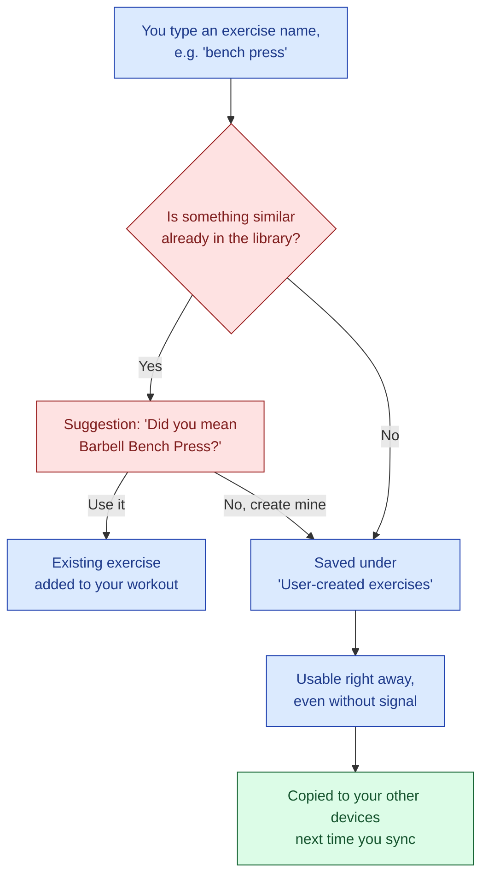

**What a custom exercise stores:**
- a name,
- the equipment used,
- an optional main muscle group,
- how it's measured (MVP: weight and reps).

**Rules:**
- **Deleting a custom exercise archives it.** It disappears from the library and from new routines, but your history with it is kept forever.
- **Renaming updates history too**, because workouts point to the exercise rather than copying its name.
- Built-in exercises ship with the app and are the same for everyone.

**Why:**
- Every lifter needs exercises the built-in library doesn't have.
- The "did you mean" check stops your history being split between near-identical names.
- Archiving instead of deleting protects the core principle that history shows what you actually did.

**What we gave up:**
- If you create the same exercise on two devices while both are offline, you'll get two separate entries.
- A future app update could add a built-in exercise you already created yourself.
- A "merge exercises" feature can fix both later.

**Changes ARCH-06:** Deleting normally removes connected records too. Exercises are the exception: they are archived, and their sets are never removed.

#### Technical detail
- Built-in and custom exercises share one `ExerciseDefinition` table with `source` = `builtin` or `custom`.
- Built-in rows have fixed UUIDs, no `user_id`, and are not synced. Custom rows are owned by the user and synced.
- Name matching ignores case and extra spaces.
- `measurement_type` is reserved for future timed and bodyweight exercises.

---

## Open questions and future needs

**Still to decide:**
- **Starting weights in a new workout:** should they be pre-filled from last time's actual weights or from the routine's plan? Recommended: last time's actuals, falling back to the plan.
- **Custom exercise limit:** unlimited for everyone, or a cap? (Hevy's free version limits custom exercises.)

**The data design must leave room for:**
- supersets (exercises grouped together),
- rep ranges (e.g. 6–8 reps instead of exactly 8),
- timed exercises (e.g. plank for 60 seconds),
- a "failure" set type,
- goals that track progress across several modules,
- a "merge exercises" feature.

---

## Glossary

| Term | Plain meaning |
|---|---|
| **Offline-first** | The app saves everything on the phone first and talks to the server later, when it can. |
| **Sync** | Copying changes between the phone and the server, in both directions. |
| **Pull / Push** | Pull: the phone asks the server for new changes. Push: the phone sends its own changes. |
| **Bookmark (cursor)** | A marker showing how far the phone has already synced, so only new changes are sent. |
| **Unique ID (UUID)** | A long random code that identifies one record. Two devices will never create the same one. |
| **Safe retry (idempotent)** | Sending the same thing twice has the same result as sending it once, so there are no duplicates. |
| **Conflict** | Two devices changed the same thing before syncing. |
| **Archive / soft delete** | Hiding a record instead of erasing it, so the change can reach other devices and history is kept. |
| **Module** | A self-contained part of the app, such as Training or Food, shown as its own tab. |
| **Migration** | A planned, step-by-step change to how data is stored, e.g. adding a table for a new module. |
| **Postgres / SQLite** | Two database systems. Postgres runs on the server; SQLite runs on the phone. |
| **Drizzle** | A tool that lets us describe and query data the same way on both databases. |

---

## Phase 1 task status

| Phase | Task | Status |
|---|---|---|
| 1 — Architecture | Start architecture conversation with Opus 5 | Done |
| 1 — Architecture | Define core entities (Routine, WorkoutSession, SessionExercise, Set, ExerciseDefinition, User) | Done — ARCH-01, 02, 03, 10 |
| 1 — Architecture | Define sync request/response shape | Done — ARCH-05 |
| 1 — Architecture | Decide conflict-resolution rule | Done — ARCH-06 |
| 1 — Architecture | Decide backend DB: SQLite vs. Postgres | Done — ARCH-07 (Postgres) |
| 1 — Architecture | Decide on-device storage: expo-sqlite vs. WatermelonDB | Done — ARCH-08 (expo-sqlite + Drizzle) |
| 1 — Architecture | Sketch auth approach (incl. Sign in with Apple requirement) | Done — ARCH-09 |
| 1 — Architecture | Record modular architecture decision *(added)* | Done — ARCH-04 |
| 1 — Architecture | Add decisions to Decision Log | Done once pasted |
| 1 — Architecture | Write initial CLAUDE.md | Not Started |
